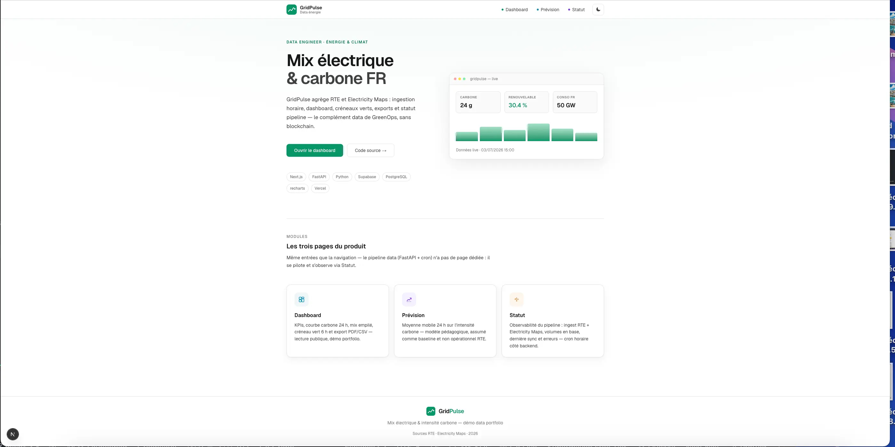
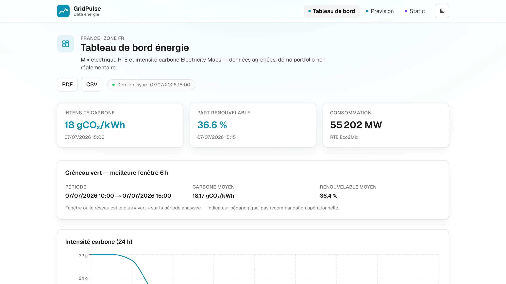
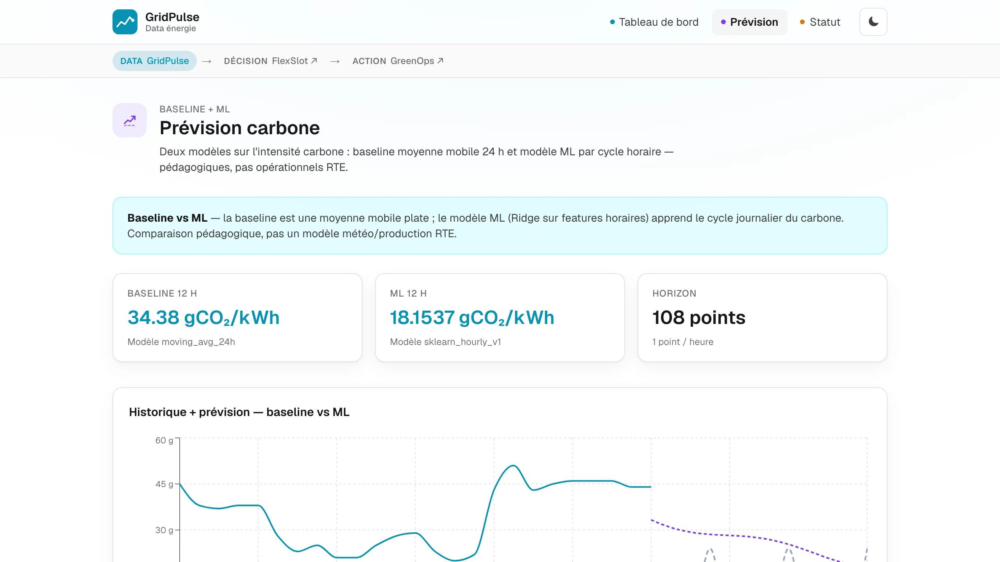
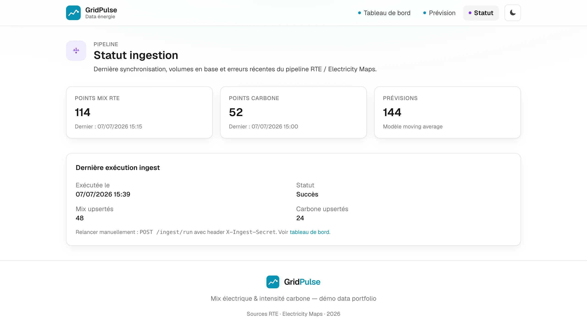

# GridPulse

Tableau de bord **data** sur le mix électrique français et l'**intensité carbone** : ingestion automatique (RTE + Electricity Maps), historique, KPIs et prévision simple.

Complément Web2 de [GreenOps](https://github.com/ChristopheChollet/GreenOps) et amont de [FlexSlot](https://github.com/ChristopheChollet/FlexSlot) — même niche énergie/climat, sans blockchain.

```
GridPulse  →  FlexSlot  →  GreenOps
  data         décision       action
```

## Captures d'écran

| Landing | Tableau de bord | Prévision | Statut |
|---|---|---|---|
|  |  |  |  |

## Architecture

```
RTE (ODRE open data) ──┐
                       ├── FastAPI (ingestion + forecast) ── Supabase ── Next.js dashboard
Electricity Maps ──────┘
```

| Couche | Stack |
|--------|--------|
| Frontend | Next.js 16, TypeScript, Tailwind 4, recharts |
| Backend | Python 3.12, FastAPI, httpx, pandas, scikit-learn |
| DB | Supabase PostgreSQL + RLS (lecture publique) |
| Orchestration | GitHub Actions (cron horaire) |

## Démarrage local

### 1. Supabase

1. Créer un projet Supabase dédié GridPulse
2. Exécuter [`supabase/migrations/001_initial.sql`](supabase/migrations/001_initial.sql) puis [`002_ingest_runs.sql`](supabase/migrations/002_ingest_runs.sql) dans le SQL Editor

### 2. Variables d'environnement

```bash
cp .env.example backend/.env
cp frontend/.env.example frontend/.env.local
```

Renseigner `SUPABASE_URL`, `SUPABASE_SERVICE_ROLE_KEY`, `ELECTRICITY_MAPS_TOKEN`, `INGEST_SECRET`.

### 3. Backend

```bash
cd backend
python -m venv .venv && source .venv/bin/activate
pip install -r requirements.txt
uvicorn app.main:app --reload --port 8000
```

### 4. Frontend

```bash
cd frontend
npm install
npm run dev
```

### 5. Première ingestion

```bash
curl -X POST http://localhost:8000/ingest/run \
  -H "X-Ingest-Secret: dev-secret"
```

Ouvrir [http://localhost:3000/dashboard](http://localhost:3000/dashboard).

## Docker Compose

```bash
docker compose up
```

## API

| Endpoint | Description |
|----------|-------------|
| `GET /health` | Health check |
| `POST /ingest/run` | Ingestion RTE + Electricity Maps (header `X-Ingest-Secret`) |
| `POST /forecast/run` | Recalcule les prévisions |
| `GET /api/v1/summary` | KPIs agrégés |
| `GET /api/v1/mix?hours=24` | Points mix RTE |
| `GET /api/v1/carbon?hours=24` | Intensité carbone |
| `GET /api/v1/forecasts?metric=carbon_intensity` | Prévisions |
| `GET /api/v1/green-windows?hours=24&window=6` | Meilleure fenêtre bas-carbone / renouvelable |
| `GET /api/v1/status` | Compteurs, dernière sync, dernier run ingest |

## V2 (dashboard avancé) — livré

- **Créneaux verts** — widget « meilleure fenêtre 6 h » sur `/dashboard`
- **Export PDF / CSV** — boutons dans l'en-tête du dashboard (pdf-lib)
- **Page `/status`** — volumes en base, dernière ingestion, erreurs pipeline

## V2.1 (ops & monitoring) — livré

- **Alertes carbone** — webhook à la **franchissement** du seuil (`CARBON_ALERT_THRESHOLD_GCO2`, défaut 200) après chaque ingestion horaire
- **Dashboard live** — refresh automatique toutes les 5 min sur `/dashboard`

Variables : `ALERT_WEBHOOK_URL`, `ALERT_WEBHOOK_ENABLED`, `CARBON_ALERT_THRESHOLD_GCO2`.

Guide pas à pas (Slack, Discord, Railway, Vercel Cron) : voir [FlexSlot `docs/ALERTES.md`](https://github.com/ChristopheChollet/FlexSlot/blob/main/docs/ALERTES.md).

## V3 (optionnel — plus tard)

> Évolutions possibles après stabilisation en prod.

| Idée | Description | Intérêt |
|------|-------------|---------|
| **Prévision ML** | Remplacer / compléter la moyenne mobile 24 h par un modèle scikit-learn (features horaires, jour/semaine) | Renforce la crédibilité côté data science |
| **Alertes e-mail** | Complément webhook (Resend / SMTP) | Canaux sans Slack |
| **Multi-zone** | DE, ES, GB via Electricity Maps (sélecteur zone) | Élargit le scope sans refonte |
| **Temps réel** | SSE ou polling court sur `/dashboard` (refresh auto sans reload) | UX plus « live » |

Ordre suggéré si V3 un jour : **ML** → **e-mail** → reste selon envie.

## Déploiement

### Frontend (Vercel)

- Root directory : `frontend`
- Variable : `NEXT_PUBLIC_API_URL` → URL Railway/Render

### Backend (Railway / Render)

- Dockerfile : `backend/Dockerfile`
- Variables : voir [`.env.example`](.env.example)

### Ingestion planifiée

Configurer les secrets GitHub :

- `GRIDPULSE_API_URL` — URL publique de l'API
- `INGEST_SECRET` — même valeur que sur le backend

## Limites (assumées)

- Prototype **non réglementaire**, pas un outil opérationnel RTE
- Prévision = **moyenne mobile 24 h**, pas modèle météo/production
- Données RTE via miroir ODRE (open data)

## Tests

```bash
cd backend && pytest
```

## Licence

MIT — Christophe Chollet
